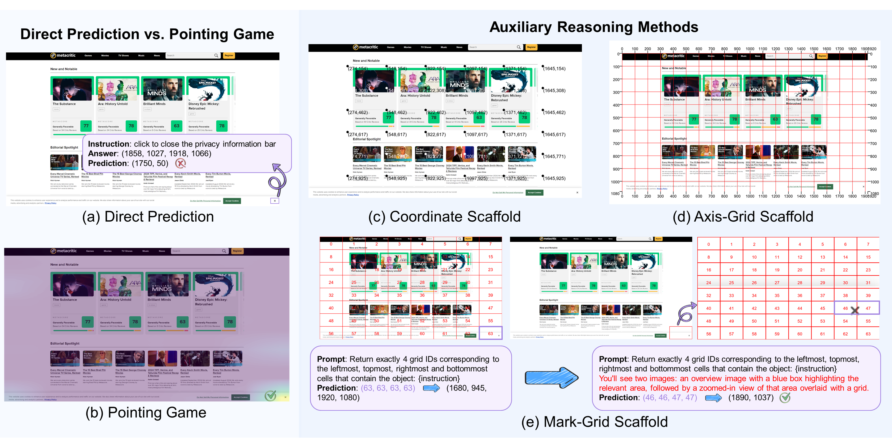
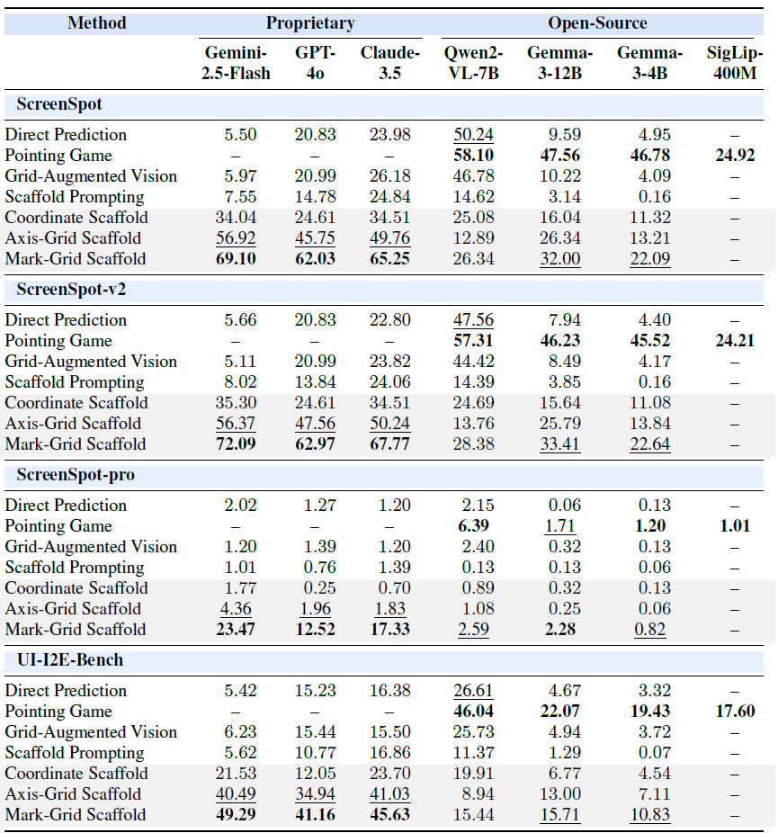

# GUI Grounding with Auxiliary Spatial Reasoning

This repository contains the official implementation of the paper:  
**"How Auxiliary Reasoning Unleashes GUI Grounding in VLMs"**

## 📖 Abstract

Graphical user interface (GUI) grounding is a fundamental task for building GUI agents. However, general vision-language models (VLMs) struggle with this task due to a lack of specific optimization for GUI grounding. We identify a key gap: while VLMs exhibit significant latent grounding potential, as demonstrated by their performance in Pointing Game, they perform poorly when tasked with outputting explicit coordinates. To address this discrepancy and bypass the high data and annotation costs of current fine-tuning approaches, we propose three zero-shot auxiliary reasoning methods. By providing explicit spatial cues such as axes, grids, and labeled intersections as part of the input image, these methods enable VLMs to articulate their implicit spatial understanding capabilities. We evaluate these methods on four GUI grounding benchmarks across seven open-source
and proprietary VLMs. The evaluation results demonstrate that the proposed methods substantially improve the performance.

## 🚀 Proposed Methods

We propose three auxiliary reasoning methods to enhance the spatial understanding of VLMs:

1.  **Coordinate Scaffold**: builds upon the existing Scaffold Prompting method\cite{lei2024scaffolding}. While the original Scaffold Prompting method labels the anchor points with row and column indices, our modification uses the actual corresponding $x,y$ coordinates of the anchor points within the image. 

2.  **Axis-Grid Scaffold**: enhances a model's spatial perception by adding a structured grid overlay. It places coordinate scales at 100-unit intervals on the image's four edges and a corresponding grid across the image. 

3.  **Mark-Grid Scaffold**: simplifies continuous coordinate prediction as a discrete grid ID prediction. This is achieved by overlaying an $8\times8$ grid on the input image, where each grid cell is labeled with a unique ID at its center. During inference, the model identifies the grid IDs corresponding to the object's four extremities: leftmost, topmost, rightmost, and bottommost. This initial bounding box is then used to crop and magnify the region of interest. The cropped region is resized proportionally to 512 pixels on its shorter side, and the same $8\times8$ grid is applied. The model is then presented with both the original image annotated with the predicted bounding box and the magnified, grid-marked crop. The model again predicts the four grid IDs defining the object's extremities within this finer-grained view. The final object coordinates are determined by calculating the center coordinates from these four grid IDs.



## 📊 Main Results

We conduct a comprehensive comparison of the performance of three baseline methods and three proposed auxiliary reasoning methods across four GUI grounding benchmarks. Overall, the auxiliary reasoning methods outperform the baselines for the majority of the VLMs. Among them, the Mark-Grid Scaffold yields the most substantial improvement, for instance, elevating Gemini-2.5-Flash’s performance from a direct inference score of 5.50\% to 72.09\% on ScreenSpot-v2. Notably, the significant performance gap between Direct Prediction and Pointing Game reveals the latent grounding capability inherent in VLMs.



## 🛠️ Setup

### Installation

1.  Clone the repository:
    ```bash
    git clone https://github.com/liweim/AuxiliaryReasoning.git
    cd AuxiliaryReasoning
    ```

2.  Create a conda environment with Python 3.9.21:
    ```bash
    conda create -n AuxiliaryReasoning python=3.9.21
    conda activate AuxiliaryReasoning
    ```

3.  Install dependencies:
    ```bash
    pip install -r requirements.txt
    ```

4.  Configure API keys:
    - Open `llm.py` and locate the `VLMAPI` class
    - Add your API keys and endpoints for the VLMs you plan to use

## 📁 Dataset Preparation

The evaluation is conducted on four benchmarks:
- **ScreenSpot**: https://huggingface.co/datasets/rootsautomation/ScreenSpot
- **ScreenSpot-v2**: https://huggingface.co/datasets/Voxel51/ScreenSpot-v2
- **ScreenSpot-Pro**: https://huggingface.co/datasets/likaixin/ScreenSpot-Pro
- **UI-I2E-Bench**: https://huggingface.co/datasets/vaundys/I2E-Bench

To download and prepare the datasets:

1.  Create a `dataset` directory:
    ```bash
    mkdir dataset
    ```

2.  Download each dataset from the above HuggingFace url and place it in the `dataset` directory. The expected structure is:
    ```
    dataset/
    ├── ScreenSpot
    ├── ScreenSpot-v2
    ├── ScreenSpot-Pro
    └── UI-I2E-Bench
    ```

3.  Run the preparation script to extract metadata:
    ```bash
    python prepare_dataset.py --dataset ScreenSpot
    ```

This will process the raw datasets and generate the necessary metadata files for evaluation.

## 🚀 Usage

### Running Evaluation on Benchmarks

The main evaluation command runs experiments on specified datasets with selected models and methods:

```bash
python main.py --dataset ScreenSpot --models gemini-2.5-flash gpt-4o claude-3.5 --methods "Direct Prediction" "Grid-Augmented Vision" "Scaffold Prompting" "Coordinate Scaffold" "Axis-Grid Scaffold" "Mark-Grid Scaffold"
```

Add --debug to visualize the intermediate processing steps:
```bash
python main.py --dataset ScreenSpot --models gemini-2.5-flash --methods "Direct Prediction" --debug
```